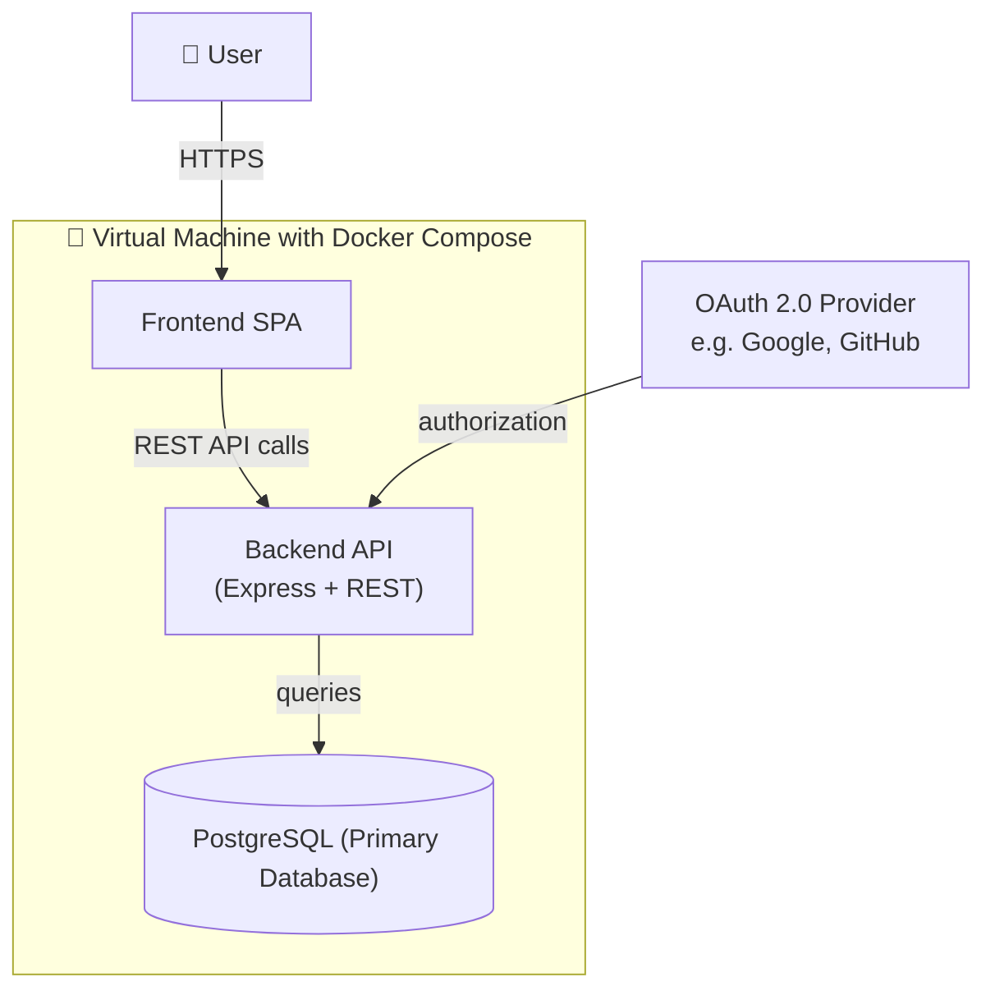

The project allows you to demonstrate that you have mastered full-stack development concepts learned from this course. As a team of 2-3, you will create a publicly available web application.

## Create the project team and project repository

Before creating a team, brainstorm with your team about the project you want to build. Your team name should be the same as your project name. It is your responsibility to have frequent meetings with your team to discuss and work on the project together, ideally, in person.

Click [here](https://classroom.github.com/a/sjGoTOz-) to create or join a Github Classroom Team

One team member should create the team, others should join the team.

## Required Elements

Projects must fulfill the following minimum requirements:

Notes on the diagram above:

- **Frontend**: Must be Angular, React-based or Vue 3. Expo, and NativeScript are **not allowed**. Must be a Single Page Application (SPA).
- **Backend**: Must use Express as the core API. The core API must be REST where appropriate.
- **Database**: PostgreSQL is required as the primary database. Additional databases (Redis, MongoDB, etc.) are allowed for specific features.
- **Deployment**: Must be deployed on a Virtual Machine using Docker and Docker Compose. All deployment files, including CI configuration for building images, must be committed to GitHub.
- **Accessibility**: The application must be publicly accessible without any extra steps (no allowlists, no setup required from your team).
- **OAuth 2.0**: The application must use OAuth 2.0 for any purpose.
- **Complexity**: The project must be of fair complexity, as determined by the instructor.

<u>Projects will NOT receive a passing grade (i.e. adjusted to <=49) if the above requirements are not fulfilled.</u>

## Capabilities

Assign each team member to the specific capabilities below equally.

| Capability                      | Weight | Description                                                                                                   |
| ------------------------------- | ------ | ------------------------------------------------------------------------------------------------------------- |
| Authentication                  | 5%     | Implement secure user login and registration with OAuth 2 only                                                |
| Look and Feel                   | 5%     | Refine the UI/UX for a professional and intuitive user experience. Serves as the mockup step                  |
| Real-time enablement            | 5%     | Using the correct technologies, enable real-time capabilities without browser reload on your web application. |
| AI Integration with MCP / tools | 5%     | Develop complex AI workflows that interacts with external sources.                                            |
| Stripe Integration              | 5%     | Set up a functional payment gateway for service subscriptions.                                                |
| Deployment Best Practices       | 5%     | Successfully host the application on DigitalOcean.                                                            |
| Architecture Best Practices     | 5%     | Frontend and backend structure compliant with C09 standards                                                   |

## Authentication / Stripe Integration

Users must be able to sign up to the application using OAuth 2.0 or your own custom login system. Before they can login, they must also "purchase" a monthly subscription to the application. Otherwise, when a user tries to login, they will be sent to the payment page. You do not need to implement a "free tier" or a free trial - it will not be given extra credit.

To standardize marking, you must use the [Stripe Checkout](https://docs.stripe.com/billing/quickstart) feature in sandbox mode.

Your team will be marked based on the following criteria:

- Security of login system
- Security of payment system
- Security of user data

Consider the following questions:

- If the user cancels a subscription and tries to login, what happens?
- If the user fails to pay for a subscription, what happens?
- If the user tries to login without a subscription, what happens?

## Proposal (5%) - GitHub

Post your idea to **#summer-2026**. No duplicate ideas are allowed — first-come, first-served. **Chatbots are strictly not allowed.**

Once approved by the instructor, write your proposal in `README.md` at the root of your project repository. The README will first be reviewed at your alpha version meeting.

### Required Contents

**Team**

- Name and utorid of every team member
- All members must acknowledge the AI usage policy and pledge to adhere to it in the project

**Summary** - A 1 paragraph summary of what your AI assistant will do.

**Capabilities** — for each capability, name the assignee and answer the corresponding questions:

| Capability                      | Questions                                                                         |
| ------------------------------- | --------------------------------------------------------------------------------- |
| Authentication                  | Which OAuth provider are you using?                                               |
| Look and Feel                   | Include a 1-page mockup of the core feature (HTML/CSS only, generated by Copilot) |
| Real-time enablement            | What technology/library are you using?                                            |
| AI Integration with MCP / tools | Which AI provider are you using? How are you planning on integrating the AI?      |
| Stripe Integration              | Provide your sandbox account publishable key                                      |
| Deployment                      | Provide an available domain name                                                  |
| Architecture                    | Everyone is responsible — no specific question                                    |

## AI Usage

Please review carefully the syllabus on approved AI usage. All rules apply. To clarify, you must only use approved models and store all chat histories in the repo. It is recommended that you keep it in a subdirectory to keep the repo clean.

## Academic Integrity

The course policy on academic integrity applies to this project. This means that all code developed for this project must be written exclusively by the members of the team. Any use of UI elements and snippets of code found on the web must be clearly cited in a credit page of the application.

You have the freedom to build whatever you want as a project, however the following restrictions strictly apply:

- You must not use your code that was developed from outside this course.
- You must not use your code that was developed for a paid or unpaid job.
- You must not use your code that was developed for another course, such as CSCC01.
- During the duration of the project, you must not be concurrently paid to do the same project for another entity.

Each team member will be held accountable for the work they submit to the team’s GitHub repository.

## Addressing Feedback

Before the Final Meeting, you must solicit feedback on your app using [givefeedback.dev](https://givefeedback.dev) and allow at least 2 students not in your group to give feedback. You must then address their feedback and be prepared to discuss your approach with the TA during the Final Meeting.

## Practical Interviews

During interviews at each step, a team member who did not implement the feature must be present during their assigned practical to answer questions regarding it, to demonstrate that they have the knowledge if they had to implement the feature. There is a 1-5% penalty for each capability for the team member who cannot satisfactorily explain the feature they are interviewed for.

### Alpha Meeting (10 mins)

Presentation: Authentication, Look and Feel

### Beta Meeting (10 mins)

Real-time enablement, Multi-step AI Integration, Stripe Integration

### Final Meeting (10 mins)

Deployment, Architecture, Cool Factor, Addressing Feedback
